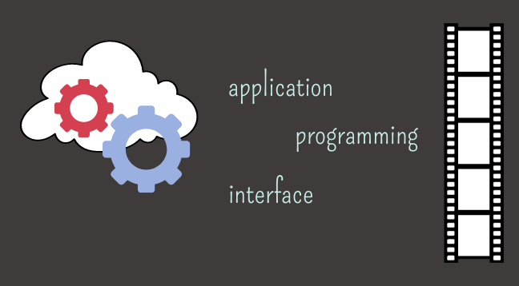

# Creando nuestras propias APIS

## Objetivo
Hasta ahora toda la comunicación entre el cliente y el servidor sigue el esquema habitual
de pedido y respuesta, donde NodeJS entrega la vista terminada al navegador. Si el cliente
quiere actualizar una parte de ese contenido, es necesario enviar todo de nuevo.
Vamos a ver cómo podemos usar las APIs para crear componentes dinámicos dentro de
nuestras páginas, y de esa forma internalizar el fundamento teórico y práctico ya visto, el
cual nos indica que una API es una especificación formal que establece cómo un módulo
de un software se comunica o interactúa con otro para cumplir una o muchas
funciones.
¡Buena suerte!😎👍✨

## M7 C35

## Clase 89, 90 y 91

## Ubicación -> Programación/TRABAJOS PRACTICOS/Creando nuestras propias APIS 